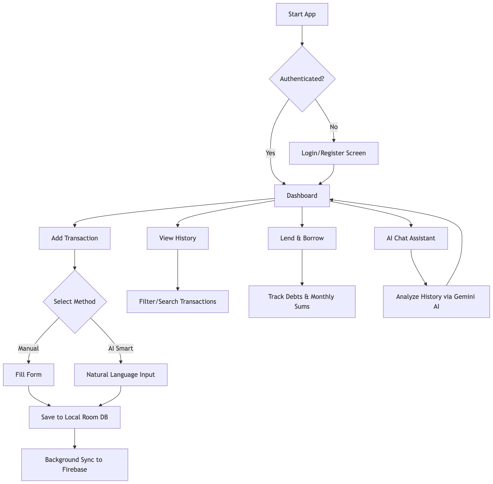

# Spendly - Smart Spend Tracker

Spendly is a modern, privacy-focused Android application designed to help users track their daily expenses with ease. It features a robust architecture combining local storage for offline speed and cloud synchronization for data safety across devices.

## 🚀 Key Features

- **Intuitive Dashboard**: Overview of your spending with beautiful donut and bar charts.
- **Lend & Borrow**: Dedicated tracking for money lent to or borrowed from others, separated from regular expenses with monthly summaries.
- **AI Tracking**: Record expenses, lendings, and borrowings naturally using smart parsing of natural language inputs.
- **Categorized Tracking**: Organize expenses into categories like UPI Apps, Quick Commerce, Groceries, Rent, and more.
- **Detailed History**: Search and filter through your entire spending history.
- **Cloud Sync**: Automatically backup and sync your data with Firebase Firestore.
- **Offline First**: Works perfectly without internet, using Room database as the local source of truth.
- **Theming**: Supports Light, Dark, and System theme preferences.
- **Clean UI**: Minimalist design focused on readability and ease of use.
- **Biometric Security**: Secure your financial data with an app-level biometric lock.
- **App Widgets**: Quick access to tracking features directly from your home screen.
- **Safety First**: Discard confirmation dialogs ensure you don't accidentally lose your tracking progress.
- **In-App Updates**: Stay up to date with the latest features and fixes seamlessly.

## 🔐 Authentication

Spendly offers multiple secure ways to sign in, all handled via **Firebase Authentication**:

- **Google Sign-In**: Quick, one-tap access using your Google account.
- **Email/Password**: Traditional registration and login with strict security requirements:
    - Minimum 8 characters.
    - At least one Uppercase, one Lowercase, one Number, and one Special Symbol.
- **Passwordless Email Link**: Sign in securely by clicking a magic link sent to your inbox—no password required.

## 🛠 Tech Stack

- **UI**: Jetpack Compose (Modern Declarative UI)
- **Dependency Injection**: Hilt
- **Local Database**: Room (with multi-user support)
- **Backend/Cloud**: Firebase (Auth & Firestore)
- **AI Integration**: Gemini AI (Gemini 1.5 Flash) parsing for smart tracking
- **Background Tasks**: WorkManager for cloud synchronization
- **App Widgets**: Jetpack Glance
- **Security**: Android Biometric API & Credential Manager
- **Updates**: Google Play In-App Update API
- **Architecture**: MVVM (Model-View-ViewModel)
- **Asynchronous**: Kotlin Coroutines & Flow

## 📖 Setup & Configuration

### Prerequisites
- [Android Studio Ladybug](https://developer.android.com/studio) or newer.
- A Firebase Project.

### Local Setup
1. **Clone the project**:
   ```bash
   git clone https://github.com/saikumar2882/spend-analyzer.git
   ```
2. **Firebase Configuration**:
   - Add your `google-services.json` to the `app/` directory.
   - Enable **Google** and **Email/Password** (with Email Link) in the Firebase Auth console.
   - Update `strings.xml` with your `default_web_client_id`.
3. **Environment Variables**:
   - Create a `.env` file based on `.env.example`.
4. **Build & Run**:
   - Open in Android Studio and run on your emulator or device.

## 🛡 Security Rules (Firestore)

Ensure your Firestore rules are set to protect user data:

```javascript
rules_version = '2';
service cloud.firestore {
  match /databases/{database}/documents {
    match /users/{userId}/spends/{spendId} {
      allow read, write: if request.auth != null && request.auth.uid == userId;
    }
  }
}
```

## 🔄 App Workflow

### Workflow Description
1.  **Authentication**: Users sign in via Google (using Credential Manager) or Email. A unique `userId` is assigned to maintain data privacy.
2.  **Security**: If enabled, the app prompts for biometric authentication before granting access to the dashboard.
3.  **Dashboard**: The app fetches local data from **Room DB** to show immediate analytics.
4.  **Data Entry**:
    *   **Manual**: User fills out amount, app, and purpose.
    *   **AI (Smart)**: User types a natural sentence (e.g., "Paid 500 for lunch via GPay"). **Gemini AI** parses this into structured data.
5.  **Processing**: Data is first saved to the local **Room Database** (Offline-first).
6.  **Synchronization**: A background **SyncWorker** (via WorkManager) ensures local data is periodically backed up to **Firebase Firestore**.
7.  **Insights**: The **Analytics Engine** groups data to generate donut/bar charts and provides an **AI Chat Assistant** for historical queries.

### Flowchart



## 📖 User Manual

### Introduction
**Spend Tracker** is a comprehensive personal finance management tool designed to help you monitor your expenses, visualize spending habits, and manage debts with the help of AI-powered insights.

### 1. Getting Started
#### Login & Security
*   **Authentication**: Securely log in using your email and password.
*   **Reset Password**: If you forget your password, use the "Forgot Password" option in the Account Security menu to receive a reset link via email.
*   **Update Password**: Change your password anytime from the **Dashboard > Security Settings** (shield icon).

### 2. Dashboard Overview
The Dashboard is your financial control center:
*   **Spending Summary**: View your total spent and transaction count for a specific period.
*   **Time Filters**: Quickly switch between Today, Week, Month, Year, or a **Custom Date Range**.
*   **Category Breakdown**: An interactive donut chart showing which categories (Food, Shopping, etc.) consume your budget.
*   **Spending Trends**: A bar chart visualizing your spending patterns over time.
*   **Top Apps**: See which applications or wallets (like Swiggy, Amazon, Zomato) you use the most.
*   **Recent Activity**: A quick glance at your latest transactions.

### 3. Managing Transactions
#### Logging a New Expense
1.  **Manual Entry**:
    *   Tap the **Add** button.
    *   **Amount**: Enter the exact amount spent.
    *   **App/Wallet**: Select from presets or choose "Other".
    *   **Date**: Defaults to today, but can be customized.
    *   **Purpose**: Select a category or type a custom one.
    *   **Notes**: Add optional details.
2.  **Quick AI Entry**:
    *   In the **Add** screen (or through the AI prompt), you can simply type or say what you spent.
    *   Example: *"Spent 300 on biryani using PhonePe"*
    *   The AI will automatically parse the amount, app, and purpose for you!
    *   **Daily Limit**: Note that AI processing has a daily request limit shown in the input box.

#### Editing & Deleting
*   Navigate to **History** or **Lend/Borrow**.
*   Tap on any transaction card to **Edit** its details.
*   Long-press or use the delete action to remove a transaction after confirmation.

### 4. History & Advanced Filtering
View every rupee spent in the **History Screen**:
*   **Search**: Use the search bar to find transactions by App Name, Purpose, or Notes.
*   **Filter**: Use category chips to isolate specific types of spending (e.g., only "Food").
*   **Monthly Grouping**: Transactions are automatically grouped by month with sub-totals for easy tracking.

### 5. Lending & Borrowing
Keep track of money owed or borrowed:
*   Use the **Lend & Borrow** screen to separate these special transactions.
*   Toggle between the **Lending** and **Borrowing** tabs to see your current balances.

### 6. AI History Assistant
Leverage AI to understand your finances:
*   Tap the **AI Assistant** (sparkle icon) on any major screen.
*   Ask questions like "How much did I spend on food last month?" or "What are my biggest expenses?"
*   Get conversational insights and summaries of your financial data.

### 7. Personalization & Security
*   **Theme Switching**: Cycle between **Light Mode**, **Dark Mode**, and **System Default** using the theme icon on the Dashboard.
*   **Biometric Lock**: Enable "App Lock" in settings to require Fingerprint or Face ID whenever you open the app.
*   **Notifications**: The app provides real-time feedback for successful saves, errors, and security updates.

### 8. Updates
*   **Auto-Update**: The app checks for newer versions on both the Play Store and GitHub, prompting you to stay updated for the best experience.

### 9. Tips for Success
*   **Be Descriptive**: Use the "Notes" field to remember specific details about unusual expenses.
*   **Review Weekly**: Use the "This Week" filter every Sunday to stay on top of your budget.
*   **Categorize Correctly**: Consistently using the same categories makes the "Category Breakdown" chart more accurate.
